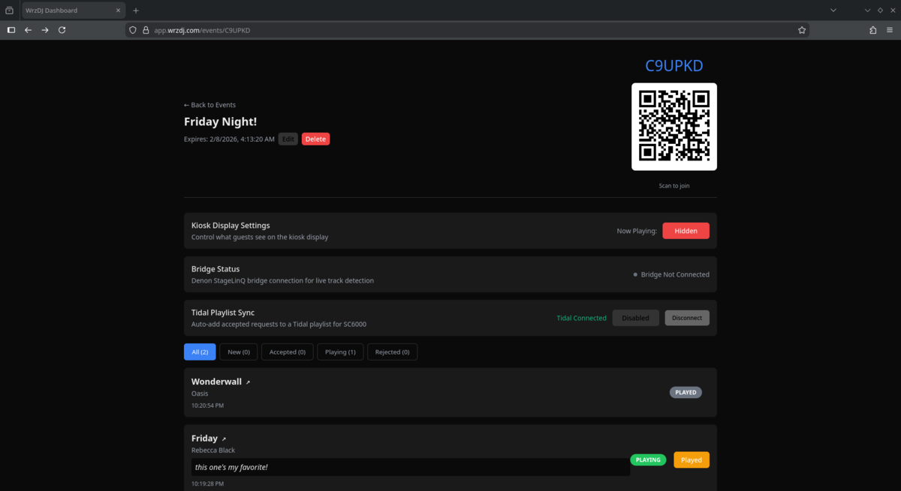

<p align="center">
  
  
  
</p>

# WrzDJ

A modern, real-time song request system for DJs. Guests scan a QR code to submit requests -- no app install, no login. DJs manage everything from a live dashboard with automatic track detection from DJ equipment via a plugin system supporting Denon StageLinQ, Pioneer PRO DJ LINK, Traktor Broadcast, and more.

<p align="center">
  
  <br>
  <em>DJ dashboard — manage requests, QR code for guests, bridge status, and Tidal sync</em>
</p>

---

## What Makes WrzDJ Different

- **Zero friction for guests** -- scan a QR code, search Spotify, submit a request. Done.
- **Live track detection** -- the bridge connects to DJ equipment via plugins (Denon StageLinQ, Pioneer PRO DJ LINK, Traktor Broadcast), so the kiosk and dashboard update in real-time as the DJ plays.
- **Automatic request matching** -- when the DJ plays a requested song, WrzDJ detects it via fuzzy matching and moves it through the workflow automatically.
- **Tidal playlist sync** -- accepted requests are auto-added to a Tidal playlist, ready for the SC6000 to load.
- **Desktop app for the bridge** -- no terminal needed. Sign in, pick your event, click Start.

---

## Features

### Guest Experience
- Scan a QR code to join an event instantly (no login required)
- Search songs via Spotify with album art and popularity info
- Submit requests with optional notes to the DJ
- Upvote other guests' requests to bump priority
- View the live request queue and see what's been accepted
- See what's playing now on the kiosk display

### DJ Dashboard
- Accept, reject, and manage incoming song requests in real-time
- Bulk accept all pending requests with one click
- Mark songs as Playing/Played with full status workflow (new -> accepted -> playing -> played)
- Toggle "Now Playing" visibility on the public kiosk
- Bridge connection status indicator (green/gray dot, polls every 3s)
- Tidal playlist sync -- auto-add accepted requests to a Tidal playlist for SC6000
- Manual Tidal track linking when auto-match fails
- Play history with source badges (Live/Manual) and request matching
- Export requests and play history to CSV
- Edit event expiry, delete events
- QR code display for easy guest onboarding

### Kiosk Display
- Public full-screen view at `/e/{code}/display`
- Three-column layout: Now Playing | Up Next | Recently Played
- Animated audio visualizer on the "Now Playing" card
- Album art from Spotify enrichment
- "Requested" badges on play history items that matched guest requests
- Built-in song request modal with 60-second inactivity timeout
- Auto-hides "Now Playing" after 60 minutes of inactivity
- Kiosk mode protections (disabled right-click, text selection)

### Stream Overlay (OBS)
- Transparent overlay at `/e/{code}/overlay` for OBS browser sources
- Shows Now Playing track with album art and LIVE badge, plus the In Queue list with vote counts
- Fully transparent background by default -- DJs control styling via OBS Custom CSS
- Copy the overlay URL directly from the DJ dashboard with one click
- **OBS setup**: Add a Browser Source, set width to 400, and use this Custom CSS:
  ```css
  html, body { background: transparent !important; margin: 0; overflow: hidden; }
  ```
  Or for a semi-transparent dark background:
  ```css
  html, body { background: rgba(10, 10, 10, 0.25) !important; margin: 0; overflow: hidden; }
  ```

### Bridge (DJ Equipment Detection)
- Plugin architecture supporting multiple DJ platforms
- **Denon StageLinQ** -- auto-detect tracks from SC6000, Prime 4, etc. over LAN with full per-deck data
- **Pioneer PRO DJ LINK** -- connect to CDJ-3000, CDJ-2000NXS2, etc. over Ethernet with full per-deck data, on-air status, and master deck detection
- **Traktor Broadcast** -- receive track metadata via Traktor's built-in Icecast broadcast
- Robust deck state machine with configurable thresholds
- Master deck priority and channel fader detection (StageLinQ)
- Capability-driven synthesis -- plugins declare what they provide, the bridge fills in the gaps
- Pause grace periods to avoid false transitions
- Real-time "Now Playing" with LIVE badge on kiosk
- Append-only play history log
- Automatic request matching via fuzzy search (artist + title)
- Request auto-transition: accepted -> playing -> played
- Spotify album art enrichment for detected tracks
- Bridge connection status visible on DJ dashboard

### Bridge Desktop App
- Cross-platform Electron app (Windows `.exe`, macOS `.dmg`, Linux `.AppImage`)
- Sign in with your WrzDJ account -- no API keys to copy/paste
- Select your active event from a dropdown
- Choose DJ protocol (StageLinQ, Pioneer PRO DJ LINK, Traktor Broadcast) with dynamic config options
- One-click Start/Stop for track detection
- Real-time status panel: connected devices, current track, per-deck states
- Configurable detection settings (live threshold, pause grace, fader detection, master deck priority)
- Auto-disconnect when event is deleted or expired
- Encrypted credential storage via OS keychain (`safeStorage`)
- Dark theme matching the WrzDJ dashboard

### Automated Releases
- GitHub Actions release workflow triggers on tag push (`v*`), not on every PR merge
- Dated versioning: `v2026.02.07`, with same-day suffix support (`v2026.02.07.2`)
- Builds bridge-app installers on 3 platforms in parallel
- Bundles deploy scripts as a `.tar.gz` artifact
- Auto-generated release notes from commit log since last tag

---

## Architecture

```
[Guests]                     [DJ]
   |                           |
   | scan QR                   | dashboard
   v                           v
[Next.js Frontend] <------> [FastAPI Backend] <--- [PostgreSQL]
                               ^
                               | HTTP (API key auth)
                               |
                        [Bridge Service]
                          (plugin system)
                        /       |        \
              StageLinQ    PRO DJ LINK   Icecast
               (LAN)       (Ethernet)    (local)
                 |              |            |
           [Denon CDJs]   [Pioneer CDJs]  [Traktor Pro]
```

| Service | Stack | Directory |
|---------|-------|-----------|
| Backend | Python, FastAPI, SQLAlchemy 2.0, PostgreSQL, Alembic | `server/` |
| Frontend | Next.js 16, React 18, TypeScript, vanilla CSS | `dashboard/` |
| Bridge | Node.js, TypeScript, plugin architecture (StageLinQ, Pioneer PRO DJ LINK, Traktor Broadcast) | `bridge/` |
| Bridge App | Electron, React, Vite, electron-forge | `bridge-app/` |

### Supported DJ Equipment

**Denon (via StageLinQ)**
- SC6000 / SC6000M
- SC5000 / SC5000M
- Prime 4 / Prime 4+
- Prime 2 / Prime Go
- X1850 / X1800 mixer (as network hub)

**Pioneer (via PRO DJ LINK)**
- CDJ-3000
- CDJ-2000NXS2 / CDJ-2000NXS
- XDJ-1000MK2 / XDJ-700
- DJM-900NXS2 / DJM-750MK2 mixer (for on-air detection)
- Requires Ethernet connection (CDJs on same LAN, not USB-only)

**Native Instruments (via Traktor Broadcast)**
- Traktor Pro 3 / Pro 4 (any controller or setup with broadcast enabled)

---

## Quick Start (Local Development)

### Prerequisites

- Docker + Docker Compose
- Python 3.11+
- Node.js 22+
- [Spotify Developer Account](https://developer.spotify.com/dashboard) (for song search)

### 1. Clone and configure

```bash
git clone https://github.com/thewrz/WrzDJ.git
cd WrzDJ
cp .env.example .env
# Edit .env with your Spotify credentials, JWT secret, etc.
```

### 2. Start the database

```bash
docker compose up -d db
```

### 3. Install git hooks

```bash
./scripts/setup-hooks.sh
```

### 4. Start the backend

```bash
cd server
python -m venv .venv
source .venv/bin/activate
pip install -e ".[dev]"
alembic upgrade head
python -m app.scripts.create_user --username admin --password admin
uvicorn app.main:app --reload --host 0.0.0.0 --port 8000
```

### 5. Start the dashboard

```bash
cd dashboard
npm install
npm run dev
```

### 6. Access the apps

- **API**: http://localhost:8000
- **API Docs**: http://localhost:8000/docs
- **Dashboard**: http://localhost:3000

### 7. (Optional) Run the bridge

For live track detection, the bridge connects to your DJ equipment and reports "Now Playing" data to the WrzDJ server.

> **The bridge requires a running WrzDJ server.** You must complete steps 1-6 above (or deploy the server) before the bridge can connect. The bridge authenticates against the server API and pushes track data to it -- without a server, the bridge has nothing to talk to.

**Option A: Desktop app (recommended)**

Download from [Releases](https://github.com/thewrz/WrzDJ/releases) (Windows `.exe`, macOS `.dmg`, Linux `.AppImage`). Sign in with your WrzDJ account, select your event, choose your DJ protocol, and click Start.

**Option B: CLI bridge**

```bash
cd bridge
npm install
cp .env.example .env
# Edit .env with your API URL, bridge API key, event code, and protocol
npm start
```

**Bridge requirements:**
- A running WrzDJ server (local or deployed) with at least one event created
- DJ equipment on the same network (StageLinQ/Pioneer) or Traktor Broadcast configured
- Node.js 22+ (CLI bridge only; the desktop app bundles its own runtime)

---

## Deployment

WrzDJ supports three deployment methods. Production uses a **subdomain model**:
- `https://app.your-domain.example` (frontend)
- `https://api.your-domain.example` (backend)

### Option 1: Docker Compose (Local Full Stack)

```bash
docker compose up --build
```

### Option 2: PaaS (Render / Railway)

**Render** -- auto-detects `render.yaml`:

1. Push to GitHub, connect to [Render](https://render.com)
2. Set Spotify credentials in the Environment tab
3. Add custom domains for API and frontend services

**Railway**:

1. Create project on [Railway](https://railway.app), add PostgreSQL
2. Deploy `server/` and `dashboard/` as separate services
3. Set environment variables (see `.env.example`)

### Option 3: VPS (Docker + nginx)

For full control on your own server:

```bash
cd /opt && git clone https://github.com/thewrz/WrzDJ.git && cd WrzDJ
cp deploy/.env.example deploy/.env  # Fill in secure values
docker compose -f deploy/docker-compose.yml up -d --build
```

Set up nginx with the provided setup script:
```bash
APP_DOMAIN=app.yourdomain.com API_DOMAIN=api.yourdomain.com ./deploy/setup-nginx.sh
sudo certbot --nginx -d app.yourdomain.com -d api.yourdomain.com
```

See `deploy/DEPLOYMENT.md` for full setup instructions.

### Required Backend Environment Variables

```
ENV=production
DATABASE_URL=<PostgreSQL connection string>
JWT_SECRET=<openssl rand -hex 32>
SPOTIFY_CLIENT_ID=<from Spotify Developer Dashboard>
SPOTIFY_CLIENT_SECRET=<from Spotify Developer Dashboard>
BRIDGE_API_KEY=<openssl rand -hex 32>
CORS_ORIGINS=https://app.yourdomain.com
PUBLIC_URL=https://app.yourdomain.com
```

---

## API Endpoints

| Endpoint | Description |
|----------|-------------|
| `POST /api/auth/login` | DJ authentication |
| `GET /api/events` | List DJ's events |
| `POST /api/events` | Create event |
| `GET /api/events/{code}/display-settings` | Get kiosk display settings |
| `PATCH /api/events/{code}/display-settings` | Toggle now playing visibility |
| `GET /api/public/e/{code}` | Get event info (public) |
| `GET /api/search` | Search songs via Spotify |
| `POST /api/requests` | Submit song request |
| `PATCH /api/requests/{id}` | Update request status |
| `POST /api/votes/{request_id}` | Upvote a request |
| `GET /api/bridge/apikey` | Get bridge API key (JWT auth) |

### Bridge Endpoints (API Key Auth)

| Endpoint | Description |
|----------|-------------|
| `POST /api/bridge/nowplaying` | Report currently playing track |
| `POST /api/bridge/status` | Report bridge connection status |
| `DELETE /api/bridge/nowplaying/{code}` | Signal track ended / deck cleared |

### Public Endpoints

| Endpoint | Description |
|----------|-------------|
| `GET /api/public/e/{code}/nowplaying` | Get current now-playing track |
| `GET /api/public/e/{code}/history` | Get play history (paginated) |
| `GET /api/public/e/{code}/requests` | Get request queue (public) |

Full interactive API documentation available at `/docs` when running the backend.

---

## Built With

WrzDJ is built on these excellent open source projects:

### Core Infrastructure
- [FastAPI](https://github.com/tiangolo/fastapi) -- high-performance Python web framework
- [SQLAlchemy](https://github.com/sqlalchemy/sqlalchemy) -- Python SQL toolkit and ORM
- [Alembic](https://github.com/sqlalchemy/alembic) -- database migration tool for SQLAlchemy
- [PostgreSQL](https://www.postgresql.org/) -- the database
- [Next.js](https://github.com/vercel/next.js) -- React framework for the dashboard and kiosk
- [React](https://github.com/facebook/react) -- UI library

### DJ Integration
- [stagelinq](https://github.com/chrisle/stagelinq) -- Node.js library for the Denon StageLinQ protocol
- [alphatheta-connect](https://github.com/chrisle/alphatheta-connect) -- TypeScript library for the Pioneer PRO DJ LINK protocol (maintained fork with encrypted Rekordbox DB support)
- [Spotipy](https://github.com/spotipy-dev/spotipy) -- Python client for the Spotify Web API
- [python-tidalapi](https://github.com/tamland/python-tidal) -- Python client for the Tidal API

### Desktop App
- [Electron](https://github.com/electron/electron) -- cross-platform desktop framework
- [Electron Forge](https://github.com/electron/forge) -- build tooling and installers for Electron
- [electron-store](https://github.com/sindresorhus/electron-store) -- persistent key-value storage for Electron
- [Vite](https://github.com/vitejs/vite) -- fast build tool and dev server

### Utilities
- [qrcode.react](https://github.com/zpao/qrcode.react) -- QR code generation for React
- [Pydantic](https://github.com/pydantic/pydantic) -- data validation for Python
- [SlowAPI](https://github.com/laurentS/slowapi) -- rate limiting for FastAPI
- [Uvicorn](https://github.com/encode/uvicorn) -- ASGI server
- [bcrypt](https://github.com/pyca/bcrypt) -- password hashing

---

## Project Structure

```
WrzDJ/
  server/              # FastAPI backend
    app/
      api/             # API routes
      core/            # Configuration, validation, rate limiting
      db/              # Database session
      models/          # SQLAlchemy models
      schemas/         # Pydantic schemas
      services/        # Business logic
    scripts/           # Startup scripts
    Dockerfile
  dashboard/           # Next.js frontend
    app/               # App router pages (dashboard, kiosk, join)
    lib/               # API client, auth, utilities
    Dockerfile
  bridge/              # DJ equipment bridge (Node.js)
    src/               # TypeScript source
      plugins/         # DJ software plugins (StageLinQ, Pioneer, Traktor)
    Dockerfile
  bridge-app/          # Electron desktop app for the bridge
    src/
      main/            # Electron main process (auth, IPC, bridge runner)
      preload/         # Context bridge (secure IPC)
      renderer/        # React UI (login, events, controls, status)
      shared/          # Shared types
  scripts/             # Git hooks and dev tooling
  deploy/              # Production deployment configs
    docker-compose.yml
    nginx/
    .env.example
  .github/workflows/   # CI + automated release pipeline
  docker-compose.yml   # Local dev compose
  render.yaml          # Render PaaS config
```

---

## License

MIT
