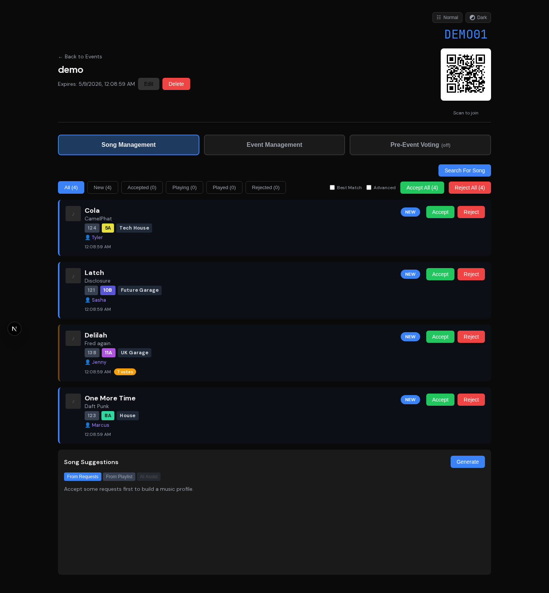
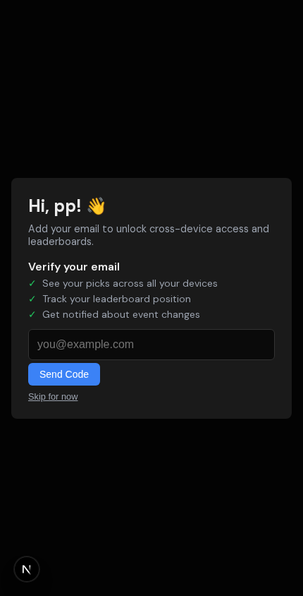

<p align="center">
  
  
  
</p>

# WrzDJ

A modern, real-time song request system for DJs. Guests scan a QR code to submit requests -- no app install, no login. DJs manage everything from a live dashboard with automatic track detection from DJ equipment via a plugin system supporting Denon StageLinQ, Pioneer PRO DJ LINK, Serato DJ, Traktor Broadcast, and more.

<p align="center">
  
  <br>
  <em>DJ dashboard -- manage requests, QR code for guests, live Now Playing detection, and kiosk controls</em>
</p>

<p align="center">
  
  <br>
  <em>Guest join page -- scan a QR code, browse the queue, and request a song (no app, no login)</em>
</p>

---

## What Makes WrzDJ Different

- **Zero friction for guests** -- scan a QR code, search Spotify, submit a request. Done.
- **Live track detection** -- the bridge connects to DJ equipment via plugins (Denon, Pioneer, Serato, Traktor), so the kiosk and dashboard update in real-time as the DJ plays.
- **Automatic request matching** -- when the DJ plays a requested song, WrzDJ detects it via fuzzy matching and moves it through the workflow automatically.
- **Multi-service playlist sync** -- accepted requests are automatically searched and added to your Tidal and Beatport playlists, with smart version filtering that respects remix/acoustic/live intent.
- **Smart song recommendations** -- three modes (from requests, from a playlist, or AI-powered natural language prompts) suggest tracks that match BPM, key, and genre. AI Assist handles vibe shifts ("switch to house music") by scoring against the requested direction, not the original set. MusicBrainz verification badges help DJs spot real artists vs. AI-generated filler.
- **Inline audio previews** -- preview Spotify and Tidal tracks directly in request cards without leaving the dashboard. Collapsed by default, expand with one click.
- **Color-coded harmonic mixing** -- Camelot key badges and BPM proximity indicators help DJs spot compatible tracks at a glance with outlier detection.
- **Desktop app for the bridge** -- no terminal needed. Sign in, pick your event, click Start.

---

## Features

### Guest Experience
- Scan a QR code to join an event instantly (no login required)
- Search songs via Spotify with album art and popularity info
- Submit requests with optional notes to the DJ
- Upvote other guests' requests to bump priority
- View the live request queue and see what's been accepted
- See what's playing now on the kiosk display
- Light/dark theme toggle with system preference detection

### DJ Dashboard
- **Tabbed event detail** -- Song Management and Event Management tabs keep the interface focused; expired/archived events show a simplified view
- **Dashboard landing page** -- events overview, cloud provider connection status, and collapsible activity log in one place
- Accept, reject, delete, and manage incoming song requests in real-time
- **DJ song search** -- search for songs across Spotify, Beatport, and Tidal from the Song Management tab and add them to the queue (auto-accepted for immediate playlist sync)
- **Refresh metadata** -- re-enrich a request's BPM, key, and genre data on demand
- Bulk accept or reject all pending requests with one click
- **Inline audio previews** -- expand a Spotify or Tidal embed directly in the request card to listen through the mixer without leaving the dashboard. Beatport requests link out to the track page.
- **Color-coded Camelot key badges** -- each request shows its musical key as a Camelot code (e.g., 8A) with harmonic mixing wheel colors, making compatible keys visually obvious
- **BPM proximity badges** -- BPM values are color-coded relative to the event's active set (green = close, amber = moderate, red = far), with IQR-based outlier detection for half-time tracks
- Mark songs as Playing/Played with full status workflow (new -> accepted -> playing -> played); **single-active playing** ensures only one request is PLAYING at a time -- marking a new one auto-transitions the previous to PLAYED
- Toggle "Now Playing" visibility on the public kiosk
- Sticky scroll -- auto-follow new incoming requests at the bottom of the queue
- **Real-time updates** -- server-sent events (SSE) push new requests, status changes, and votes to the dashboard without polling
- Bridge connection status indicator (green/gray dot, polls every 3s)
- Multi-service playlist sync -- auto-add accepted requests to Tidal and Beatport playlists
- Smart version filtering -- detects intent (remix, acoustic, sped-up, live) and matches the right version
- Manual track linking when auto-match fails -- click a "Missing" badge to search and pick the right track
- Play history with source badges (Live/Manual) and request matching
- Export requests and play history to CSV
- Edit event expiry, delete events
- **Event banner images** -- upload a custom banner per event (JPEG/PNG/GIF/WebP, resized to 1920x480, converted to WebP). Two variants are generated: original for the guest join page (blurred background) and a desaturated version for the kiosk display. Dominant colors are extracted for theme-safe backgrounds.
- Cloud Providers card -- connect Tidal and Beatport via OAuth, toggle playlist sync per event, see subscription tier, with labeled column headers for at-a-glance status
- QR code display for easy guest onboarding
- **Kiosk management** -- pair, rename, reassign, and unpair kiosk displays directly from the event page
- **Activity log** -- bridge connect/disconnect events and sync errors are logged and surfaced on the dashboard
- **Help system** -- contextual help tooltips and a guided onboarding tour for first-time DJs, with server-side persistence of completed tours
- Light/dark theme toggle with system preference detection

### Song Recommendations
- **Three recommendation modes** to help DJs discover tracks that fit the vibe:
  - **From Requests** -- builds a musical profile (BPM, key, genre) from accepted/played requests, then searches Tidal and Beatport for compatible tracks
  - **From Playlist** -- select any Tidal or Beatport playlist as the profile source instead of requests
  - **AI Assist** -- describe what you want in plain English (e.g., "90s hip hop vibes", "switch to house music", "dark techno like Amelie Lens") and Claude Haiku interprets the prompt into structured search queries. Vibe shift detection automatically scores results against the requested direction rather than the current set profile.
- Suggestion cards display Camelot key badges, BPM proximity badges, genre badges, and inline audio previews -- the same visual language as request cards
- Tracks scored on BPM compatibility, key harmony (Camelot wheel), and genre similarity
- Half-time BPM matching (e.g., 65 BPM matches 130 BPM tracks) and genre family grouping
- Artist diversity penalties keep results varied -- repeated and source artists are downranked
- Junk filtering removes backing tracks, drumless versions, karaoke, DJ tools, and cover/tribute versions
- **MusicBrainz artist verification** -- recommended artists are checked against MusicBrainz's community-curated database, with a green "Verified Artist" badge to distinguish real artists from AI-generated filler. Results cached server-wide for instant subsequent lookups.
- **Multi-artist intelligence** -- composite artist strings (e.g., "Darude, Ashley Wallbridge, Foux") are split and matched individually for more accurate scoring and search
- Background metadata enrichment -- submitted requests are enriched with genre, BPM, and key via a priority cascade: ISRC exact matching, direct Beatport/Tidal fetch, MusicBrainz genre lookup, then fuzzy search
- Half-time/double-time BPM correction -- detects and normalizes BPM values using event context (e.g., 66 BPM in a 128-132 BPM event corrects to 132)
- Soundcharts discovery integration -- when configured, uses genre+BPM+key filtered search for higher-quality candidates
- One-click accept to add a suggestion as a request, or Accept All for the full batch
- Suggestions persist across mode switches so you don't lose results when exploring different approaches

### Admin Dashboard
- System overview with user, event, and request counts
- User management -- approve/reject pending registrations, assign roles (admin/dj/pending), deactivate accounts with last-admin protection (prevents accidental lockout)
- Event management -- view and manage all events across all DJs
- Integration health dashboard -- check auth status, catalog search, and playlist sync for each service with manual health check buttons
- Per-service enable/disable toggles (Spotify, Tidal, Beatport, Bridge) -- temporarily disable a broken integration at runtime; DJs see "Currently Unavailable"
- **AI / LLM settings** -- enable/disable the LLM service, select Claude model, configure per-minute rate limits, view API key status
- System settings -- toggle self-registration, adjust search rate limits (all settings are database-backed and take effect immediately, no restart required)

### Kiosk Display
- Public full-screen view at `/e/{code}/display`
- Three-column layout: Now Playing | Up Next | Recently Played
- Animated audio visualizer on the "Now Playing" card
- Album art from Spotify enrichment
- "Requested" badges on play history items that matched guest requests
- Built-in song request modal with 60-second inactivity timeout
- **Custom banner backgrounds** -- event banners render as desaturated, full-width backgrounds with gradient fade-out, giving each event a unique visual identity
- **QR pairing** -- kiosk devices visit `/kiosk-pair` to generate a 6-character pairing code + QR. DJ scans the QR, selects an event, and the kiosk auto-navigates to the display. Pairing survives power cycles via session token persistence.
- **Unpair detection** -- if a DJ unpairs a kiosk, it automatically redirects back to the pairing screen
- **Display-only mode** -- hide the request button on non-touch kiosk screens (mounted displays); QR code stays visible for phone scanning
- **Requests-closed banner** -- when the DJ closes requests, a prominent banner replaces the QR code and the request button is hidden
- Auto-hides "Now Playing" after configurable minutes of inactivity
- Kiosk mode protections (disabled right-click, text selection)

### Kiosk Deployment (Raspberry Pi)
- Turnkey setup script transforms a fresh Raspberry Pi OS Lite into a dedicated kiosk appliance
- **WiFi captive portal** -- if WiFi isn't pre-configured, the Pi starts a hotspot (`WrzDJ-Kiosk`) and serves a touchscreen-friendly WiFi setup page. Phones connecting to the hotspot get redirected to the portal automatically.
- **Cage + Chromium** -- locked-down Wayland compositor (Cage) runs Chromium in kiosk mode with no desktop, no escape routes
- **Crash recovery watchdog** -- systemd timer monitors the kiosk service, clears Chromium crash flags, and auto-restarts on failure
- **Optional overlayfs** -- write-protect the SD card to prevent filesystem corruption from power cuts (kiosk re-pairs in ~30s on reboot)
- Dedicated `kiosk` user with minimal privileges (input, video, render groups only)
- Configuration via `/etc/wrzdj-kiosk.conf` -- change URL or rotation without re-running setup
- Self-healing: if Cage exits, getty auto-restarts the login session which re-launches Cage

### Stream Overlay (OBS)
- Transparent overlay at `/e/{code}/overlay` for OBS browser sources
- Shows Now Playing track with album art and LIVE badge, plus the In Queue list with vote counts
- Fully transparent background by default -- DJs control styling via OBS Custom CSS
- Copy the overlay URL directly from the DJ dashboard with one click
- **OBS setup**: Add a Browser Source, set width to 400, and use this Custom CSS:
  ```css
  html, body { background: transparent !important; margin: 0; overflow: hidden; }
  ```
  Or for a semi-transparent dark background:
  ```css
  html, body { background: rgba(10, 10, 10, 0.25) !important; margin: 0; overflow: hidden; }
  ```

### Bridge (DJ Equipment Detection)
- Plugin architecture supporting multiple DJ platforms
- **Denon StageLinQ** -- auto-detect tracks from SC6000, Prime 4, etc. over LAN with full per-deck data
- **Pioneer PRO DJ LINK** -- connect to CDJ-3000, CDJ-2000NXS2, etc. over Ethernet with full per-deck data, on-air status, and master deck detection
- **Serato DJ** -- watch Serato's binary session files for per-deck track metadata with album info
- **Traktor Broadcast** -- receive track metadata via Traktor's built-in Icecast broadcast
- Robust deck state machine with configurable thresholds
- Master deck priority and channel fader detection (StageLinQ)
- Capability-driven synthesis -- plugins declare what they provide, the bridge fills in the gaps
- Pause grace periods to avoid false transitions
- Real-time "Now Playing" with LIVE badge on kiosk
- Append-only play history log
- Automatic request matching via fuzzy search (artist + title)
- Request auto-transition: accepted -> playing -> played
- Spotify album art enrichment for detected tracks
- Bridge connection status visible on DJ dashboard
- **Reliability features** -- circuit breaker pattern for API calls, automatic reconnection with exponential backoff, fetch timeouts, and track buffer replay (tracks detected while disconnected are re-sent once the connection is restored)
- **Structured logging** -- timestamped, leveled log output (info/warn/error) with persistent log storage and debug export for troubleshooting
- **Data-driven plugin UI** -- plugins declare their config options (type, defaults, min/max), and the bridge app auto-generates the settings panel with no hardcoded UI per plugin

### Bridge Desktop App
- Cross-platform Electron app (Windows `.exe`, macOS `.dmg`, Linux `.AppImage`)
- Also available via `winget install WrzDJ.WrzDJ-Bridge` on Windows
- Sign in with your WrzDJ account -- no API keys to copy/paste
- Select your active event from a dropdown
- Choose your DJ software/hardware (Denon, Pioneer, Serato, Traktor) with dynamic config options per plugin
- One-click Start/Stop for track detection
- Real-time status panel: connected devices, current track, per-deck states
- Configurable detection settings (live threshold, pause grace, fader detection, master deck priority)
- Auto-disconnect when event is deleted or expired
- Encrypted credential storage via OS keychain (`safeStorage`)
- Dark theme matching the WrzDJ dashboard

### Self-Registration
- DJs can sign up without needing an admin to create their account
- Admin approval required before new accounts can create events
- Cloudflare Turnstile CAPTCHA protects against bot registrations
- Admin can enable/disable self-registration from the Settings page

### Data Protection
- OAuth tokens (Tidal, Beatport) encrypted at rest via Fernet (AES-128-CBC + HMAC) -- if the database is compromised, tokens remain unreadable without the server's encryption key. `TOKEN_ENCRYPTION_KEY` is required in production (missing key = fatal startup error).
- Beatport OAuth uses PKCE (S256 code challenge) for secure authorization
- Content Security Policy headers on the dashboard
- Passwords hashed with bcrypt
- Rate limiting on all public and mutation endpoints

### Automated Releases
- GitHub Actions release workflow triggers on tag push (`v*`), not on every PR merge
- Dated versioning: `v2026.02.07`, with same-day suffix support (`v2026.02.07.2`)
- Builds bridge-app installers on 3 platforms in parallel
- Bundles deploy scripts as a `.tar.gz` artifact
- Auto-generated release notes from commit log since last tag

---

## Architecture

```
[Guests]                     [DJ]
   |                           |
   | scan QR                   | dashboard
   v                           v
[Next.js Frontend] <------> [FastAPI Backend] <--- [PostgreSQL]
                               |          |
                     +---------+----------+---------+
                     |         |          |         |          |
                  [Spotify] [Tidal]  [Beatport]  [MusicBrainz] [Soundcharts]
                  (search)  (sync +   (sync +    (genre +       (discovery +
                            search)   search)    verification)   BPM/key)
                               ^
                               | HTTP (API key auth)
                               |
                        [Bridge Service]
                          (plugin system)
                      /       |        |        \
            StageLinQ   PRO DJ LINK  Session    Icecast
              (LAN)      (Ethernet)   (file)    (local)
                |             |          |          |
          [Denon CDJs]  [Pioneer CDJs] [Serato]  [Traktor Pro]
```

| Service | Stack | Directory |
|---------|-------|-----------|
| Backend | Python, FastAPI, SQLAlchemy 2.0, PostgreSQL, Alembic | `server/` |
| Frontend | Next.js 16, React 19, TypeScript, vanilla CSS | `dashboard/` |
| Bridge | Node.js, TypeScript, plugin architecture (StageLinQ, Pioneer PRO DJ LINK, Serato DJ, Traktor Broadcast) | `bridge/` |
| Bridge App | Electron, React, Vite, electron-forge | `bridge-app/` |
| Kiosk | Raspberry Pi, Cage (Wayland), Chromium, Python stdlib | `kiosk/` |

### Supported DJ Equipment

**Denon (via StageLinQ)**
- SC6000 / SC6000M
- SC5000 / SC5000M
- Prime 4 / Prime 4+
- Prime 2 / Prime Go
- X1850 / X1800 mixer (as network hub)

**Pioneer (via PRO DJ LINK)**
- CDJ-3000
- CDJ-2000NXS2 / CDJ-2000NXS
- XDJ-1000MK2 / XDJ-700
- DJM-900NXS2 / DJM-750MK2 mixer (for on-air detection)
- Requires Ethernet connection (CDJs on same LAN, not USB-only)

**Serato (via session file monitoring)**
- Serato DJ Pro / Serato DJ Lite (any controller or setup)
- Per-deck track detection with album metadata
- No network configuration required -- reads session files from disk

**Native Instruments (via Traktor Broadcast)**
- Traktor Pro 3 / Pro 4 (any controller or setup with broadcast enabled)

---

## Quick Start (Local Development)

### Prerequisites

- Docker + Docker Compose
- Python 3.11+
- Node.js 22+
- [Spotify Developer Account](https://developer.spotify.com/dashboard) (for song search)

### 1. Clone and configure

```bash
git clone https://github.com/thewrz/WrzDJ.git
cd WrzDJ
cp .env.example .env
# Edit .env with your Spotify credentials, JWT secret, etc.
```

### 2. Start the database

```bash
docker compose up -d db
```

### 3. Install git hooks

```bash
./scripts/setup-hooks.sh
```

### 4. Start the backend

```bash
cd server
python -m venv .venv
source .venv/bin/activate
pip install -e ".[dev]"
alembic upgrade head
python -m app.scripts.create_user --username admin --password admin
uvicorn app.main:app --reload --host 0.0.0.0 --port 8000
```

### 5. Start the dashboard

```bash
cd dashboard
npm install
npm run dev
```

### 6. Access the apps

- **API**: http://localhost:8000
- **API Docs**: http://localhost:8000/docs
- **Dashboard**: http://localhost:3000

### 7. (Optional) Run the bridge

For live track detection, the bridge connects to your DJ equipment and reports "Now Playing" data to the WrzDJ server.

> **The bridge requires a running WrzDJ server.** You must complete steps 1-6 above (or deploy the server) before the bridge can connect. The bridge authenticates against the server API and pushes track data to it -- without a server, the bridge has nothing to talk to.

**Option A: Desktop app (recommended)**

Download from [Releases](https://github.com/thewrz/WrzDJ/releases) (Windows `.exe`, macOS `.dmg`, Linux `.AppImage`). Sign in with your WrzDJ account, select your event, choose your DJ protocol, and click Start.

**Option B: CLI bridge**

```bash
cd bridge
npm install
cp .env.example .env
# Edit .env with your API URL, bridge API key, event code, and protocol
npm start
```

**Bridge requirements:**
- A running WrzDJ server (local or deployed) with at least one event created
- DJ equipment on the same network (StageLinQ/Pioneer), Serato running on the same machine, or Traktor Broadcast configured
- Node.js 22+ (CLI bridge only; the desktop app bundles its own runtime)

---

## Deployment

WrzDJ supports three deployment methods. Production uses a **subdomain model**:
- `https://app.your-domain.example` (frontend)
- `https://api.your-domain.example` (backend)

### Option 1: Docker Compose (Local Full Stack)

```bash
docker compose up --build
```

### Option 2: PaaS (Render / Railway)

**Render** -- auto-detects `render.yaml`:

1. Push to GitHub, connect to [Render](https://render.com)
2. Set Spotify credentials in the Environment tab
3. Add custom domains for API and frontend services

**Railway**:

1. Create project on [Railway](https://railway.app), add PostgreSQL
2. Deploy `server/` and `dashboard/` as separate services
3. Set environment variables (see `.env.example`)

### Option 3: VPS (Docker + nginx)

For full control on your own server:

```bash
cd /opt && git clone https://github.com/thewrz/WrzDJ.git && cd WrzDJ
cp deploy/.env.example deploy/.env  # Fill in secure values
docker compose -f deploy/docker-compose.yml up -d --build
```

Set up nginx with the provided setup script:
```bash
APP_DOMAIN=app.yourdomain.com API_DOMAIN=api.yourdomain.com ./deploy/setup-nginx.sh
sudo certbot --nginx -d app.yourdomain.com -d api.yourdomain.com
```

See `deploy/DEPLOYMENT.md` for full setup instructions.

### Required Backend Environment Variables

```
ENV=production
DATABASE_URL=<PostgreSQL connection string>
JWT_SECRET=<openssl rand -hex 32>
TOKEN_ENCRYPTION_KEY=<openssl rand -hex 32>
SPOTIFY_CLIENT_ID=<from Spotify Developer Dashboard>
SPOTIFY_CLIENT_SECRET=<from Spotify Developer Dashboard>
TIDAL_CLIENT_ID=<from Tidal Developer Portal>
TIDAL_CLIENT_SECRET=<from Tidal Developer Portal>
BEATPORT_CLIENT_ID=<from Beatport API>
BEATPORT_CLIENT_SECRET=<from Beatport API>
BRIDGE_API_KEY=<openssl rand -hex 32>
ANTHROPIC_API_KEY=<from Anthropic Console, optional -- enables AI Assist recommendations>
CORS_ORIGINS=https://app.yourdomain.com
PUBLIC_URL=https://app.yourdomain.com
```

---

## API Endpoints

| Endpoint | Description |
|----------|-------------|
| `POST /api/auth/login` | DJ authentication |
| `GET /api/events` | List DJ's events |
| `POST /api/events` | Create event |
| `GET /api/events/{code}/display-settings` | Get kiosk display settings |
| `PATCH /api/events/{code}/display-settings` | Toggle now playing visibility |
| `GET /api/public/e/{code}` | Get event info (public) |
| `GET /api/search` | Search songs via Spotify |
| `POST /api/requests` | Submit song request |
| `PATCH /api/requests/{id}` | Update request status |
| `POST /api/votes/{request_id}` | Upvote a request |
| `POST /api/events/{code}/recommendations` | Generate algorithmic song recommendations |
| `POST /api/events/{code}/recommendations/from-template` | Generate recommendations from a playlist |
| `POST /api/events/{code}/recommendations/llm` | Generate LLM-powered recommendations from a prompt |
| `GET /api/events/{code}/playlists` | List DJ's playlists from connected services |
| `GET /api/bridge/apikey` | Get bridge API key (JWT auth) |

### Banner Endpoints

| Endpoint | Description |
|----------|-------------|
| `POST /api/events/{code}/banner` | Upload event banner image (multipart) |
| `DELETE /api/events/{code}/banner` | Delete event banner |

### Kiosk Pairing Endpoints

| Endpoint | Description |
|----------|-------------|
| `POST /api/public/kiosk/pair` | Generate kiosk pairing code + session token (public) |
| `GET /api/public/kiosk/pair/{code}/status` | Poll pairing status (public, kiosk polls this) |
| `GET /api/public/kiosk/session/{token}/assignment` | Poll assignment after reboot (session persistence) |
| `POST /api/kiosk/pair/{code}/complete` | Complete pairing by selecting event (DJ auth) |
| `GET /api/kiosk/mine` | List kiosks paired by current DJ |
| `PATCH /api/kiosk/{id}/assign` | Reassign kiosk to different event |
| `DELETE /api/kiosk/{id}` | Unpair and delete kiosk |

### Bridge Endpoints (API Key Auth)

| Endpoint | Description |
|----------|-------------|
| `POST /api/bridge/nowplaying` | Report currently playing track |
| `POST /api/bridge/status` | Report bridge connection status |
| `DELETE /api/bridge/nowplaying/{code}` | Signal track ended / deck cleared |

### Public Endpoints

| Endpoint | Description |
|----------|-------------|
| `GET /api/public/e/{code}/nowplaying` | Get current now-playing track |
| `GET /api/public/e/{code}/history` | Get play history (paginated) |
| `GET /api/public/e/{code}/requests` | Get request queue (public) |

Full interactive API documentation available at `/docs` when running the backend.

---

## Built With

WrzDJ is built on these excellent open source projects:

### Core Infrastructure
- [FastAPI](https://github.com/tiangolo/fastapi) -- high-performance Python web framework
- [SQLAlchemy](https://github.com/sqlalchemy/sqlalchemy) -- Python SQL toolkit and ORM
- [Alembic](https://github.com/sqlalchemy/alembic) -- database migration tool for SQLAlchemy
- [PostgreSQL](https://www.postgresql.org/) -- the database
- [Next.js](https://github.com/vercel/next.js) -- React framework for the dashboard and kiosk
- [React](https://github.com/facebook/react) -- UI library

### DJ Integration
- [stagelinq](https://github.com/chrisle/stagelinq) -- Node.js library for the Denon StageLinQ protocol
- [alphatheta-connect](https://github.com/chrisle/alphatheta-connect) -- TypeScript library for the Pioneer PRO DJ LINK protocol (maintained fork with encrypted Rekordbox DB support)
- [Spotipy](https://github.com/spotipy-dev/spotipy) -- Python client for the Spotify Web API (song search)
- [python-tidalapi](https://github.com/tamland/python-tidal) -- Python client for the Tidal API (playlist sync + recommendation search)
- [Beatport API v4](https://api.beatport.com) -- Beatport catalog search, playlist sync, and recommendation candidates
- [MusicBrainz API](https://musicbrainz.org/doc/MusicBrainz_API) -- community-curated artist genre enrichment and artist verification
- [Soundcharts API](https://soundcharts.com/) -- structured discovery search for recommendation candidates (BPM, key, genre filters)
- [Anthropic Claude API](https://docs.anthropic.com/) -- LLM-powered AI Assist mode for natural language recommendation prompts

### Desktop App
- [Electron](https://github.com/electron/electron) -- cross-platform desktop framework
- [Electron Forge](https://github.com/electron/forge) -- build tooling and installers for Electron
- [electron-store](https://github.com/sindresorhus/electron-store) -- persistent key-value storage for Electron
- [Vite](https://github.com/vitejs/vite) -- fast build tool and dev server

### Utilities
- [qrcode.react](https://github.com/zpao/qrcode.react) -- QR code generation for React
- [Pydantic](https://github.com/pydantic/pydantic) -- data validation for Python
- [SlowAPI](https://github.com/laurentS/slowapi) -- rate limiting for FastAPI
- [Uvicorn](https://github.com/encode/uvicorn) -- ASGI server
- [bcrypt](https://github.com/pyca/bcrypt) -- password hashing

---

## Project Structure

```
WrzDJ/
  server/              # FastAPI backend
    app/
      api/             # API routes
      core/            # Configuration, validation, rate limiting
      db/              # Database session
      models/          # SQLAlchemy models
      schemas/         # Pydantic schemas
      services/        # Business logic
        recommendation/  # Scoring, enrichment, LLM, MusicBrainz verification
        sync/            # Multi-service playlist sync orchestrator
    scripts/           # Startup scripts
    Dockerfile
  dashboard/           # Next.js frontend
    app/               # App router pages (dashboard, kiosk, join, admin)
      kiosk-pair/      # Device-side pairing page (generates QR code)
      kiosk-link/[code]/ # DJ-side pairing completion (event picker)
    lib/               # API client, auth, utilities
    Dockerfile
  bridge/              # DJ equipment bridge (Node.js)
    src/               # TypeScript source
      plugins/         # DJ software plugins (StageLinQ, Pioneer, Serato, Traktor)
    Dockerfile
  bridge-app/          # Electron desktop app for the bridge
    src/
      main/            # Electron main process (auth, IPC, bridge runner)
      preload/         # Context bridge (secure IPC)
      renderer/        # React UI (login, events, controls, status)
      shared/          # Shared types
  kiosk/               # Raspberry Pi kiosk deployment
    setup.sh           # Idempotent setup script (Pi OS Lite -> kiosk)
    wifi-portal/       # WiFi captive portal (Python stdlib only)
    systemd/           # Service definitions (kiosk, portal, watchdog)
    overlayfs/         # Optional SD card write protection
  scripts/             # Git hooks and dev tooling
  deploy/              # Production deployment configs
    docker-compose.yml
    nginx/
    .env.example
  .github/workflows/   # CI + automated release pipeline
  docker-compose.yml   # Local dev compose
  render.yaml          # Render PaaS config
```

---

## License

MIT
